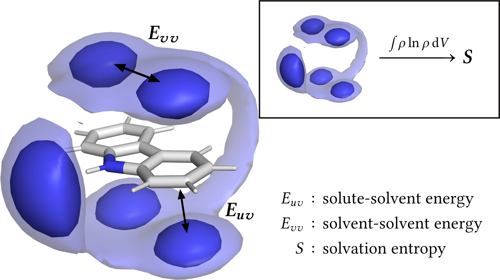

# GIST-Tutorial
A tutorial for Grid Inhomogenous Solvation Theory (GIST) as implemented in AmberTool's cpptraj.
The tutorial aims to teach how to apply GIST for small molecules and proteins, with biotin-streptavidin as a showcase example.

The current version of the manuscript is found on our GitHub page [liedlab.github.io](https://liedllab.github.io/gist/). 

The tutorial is developed in line with LiveCoMS guidelines on [Paper Writing as Code Development ](https://livecomsjournal.github.io/about/paper_code/) and will be further updated in correspondence with the community. 
If you notice any issues or have suggestions, please raise them as an [Issue](https://github.com/liedllab/gist-tutorial/issues) or write up a [Pull Request](https://github.com/liedllab/gist-tutorial/pulls).

# Repository Content
This repository contains the following folders and files:
- [code](https://github.com/liedllab/gist-tutorial/tree/main/code): Input files and scripts to run the Biotin/Streptavidin example shown in the manuscript.
- [manuscript](https://github.com/liedllab/gist-tutorial/tree/main/manuscript): LaTeX files for the manuscript and bibliography.
- [manuscript/figures](https://github.com/liedllab/gist-tutorial/tree/main/manuscript/figures): Figures and plots used in the manuscript.
- [output](https://github.com/liedllab/gist-tutorial/tree/main/output): GIST output for the example provided in the manuscript.
- [github/workflows](https://github.com/liedllab/gist-tutorial/tree/repo-updates/.github/workflows): A GitHub Actions workflow to automatically compile and publish the manuscript.
  
# Dependencies and Installation
* [cpptraj](https://github.com/Amber-MD/cpptraj) (Version 6.24 or higher)
* [gisttools](https://github.com/liedllab/gisttools) (Version 0.2 or higher)
* [mdtraj](https://github.com/mdtraj/mdtraj) (Version 1.9.7 or higher)
* [numpy](https://numpy.org/) (Tested with version 1.23.5)
* [pandas](https://pandas.pydata.org) (Tested with version 1.5.3)

To install the dependencies, we recommend using [mamba](https://mamba.readthedocs.io/en/latest/) or [conda](https://docs.conda.io/en/latest/). A python environment can then be created with the following command:
```bash
mamba create -n gist-tutorial python=3.10 numpy pandas mdtraj dacase::ambertools-dac=25
mamba activate gist-tutorial
```
Note that `gisttools` is not available via mamba/conda, and must be installed manually. You can do this by cloning its repository and installing it with pip:
```bash
git clone https://github.com/liedllab/gisttools.git
cd gisttools
pip install .
```

The molecular dynamics simulations used in the tutorial are hosted here:   
[](https://researchdata.uibk.ac.at/doi/10.48323/4mbrd-67m83)

The tutorial code is provided as a Jupyter Notebook at `code/tutorial-gist.ipynb`.    
We recommend using [JupyterLab](https://jupyter.org/) or [VS Code](https://code.visualstudio.com/) (with the Jupyter extensions) for editing and working with the notebook.

Molecular visualisations are generated with [PyMol](https://pymol.org/) and input scripts are provided in the `output/visualization` folder.
# Authors
In the same order as in the manuscript:
* Valentin J. Egger-Hoerschinger
* Franz Waibl
* Vjay Molino
* Helmut Carter
* Monica L. Fernández-Quintero
* Steven Ramsey
* Daniel R. Roe
* Klaus R. Liedl
* Michael K. Gilson
* Tom Kurtzman
  
The repository is currently managed by Valentin ([@vhoer](https://www.github.com/vhoer)).

# Citation
```
@article{EggerHoerschinger2025,
author = {Egger-Hoerschinger, Valentin J. and Waibl, Franz and Molino, Vjay and Carter, Helmut and Fernández-Quintero, Monica L. and Ramsey, Steven and Roe, Daniel R. and Liedl, Klaus R. and Gilson, Michael K. and Kurtzman, Tom},
title = {Quantifying Spatially Resolved Hydration Thermodynamics Using Grid Inhomogeneous Solvation Theory [Article v1.0]},
journal = {Living Journal of Computational Molecular Science},
volume = {6},
number = {1},
pages = {3059},
year = {2025},
doi = {11.33011/livecoms.6.1.3059},
}
```
